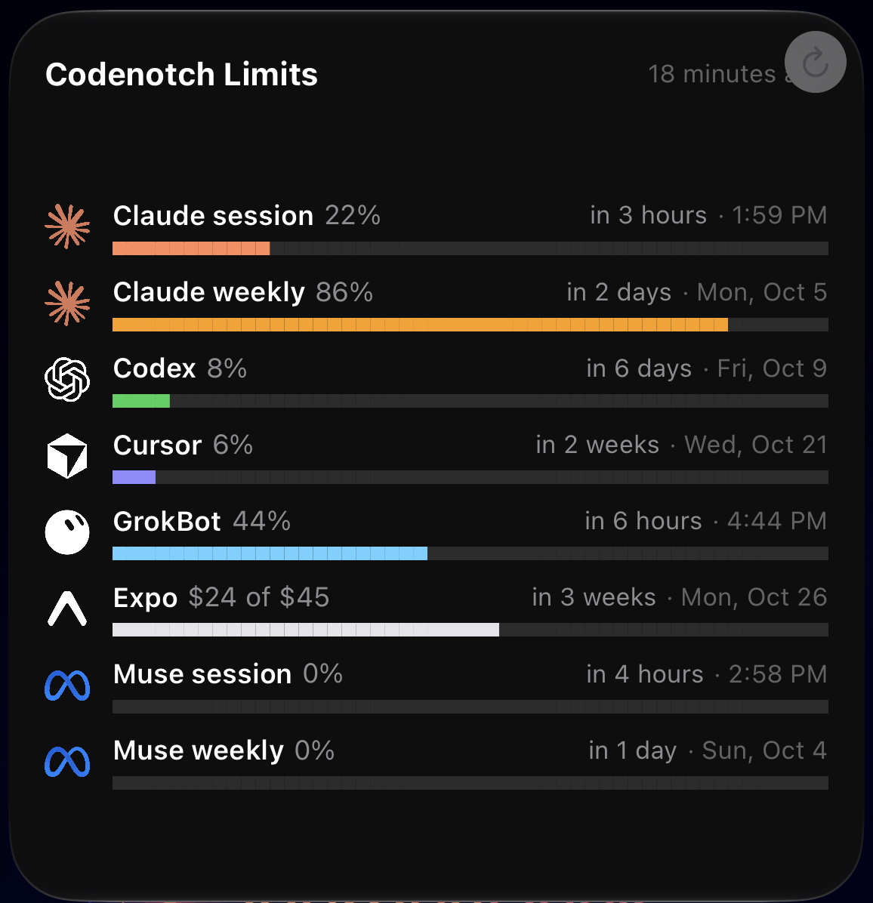

# Codenotch → Glance

Your AI usage limits from [Codenotch](https://github.com/vinzdg/codenotch) as iPhone Home Screen widgets, via [Glance](https://glance.cool). Your computer pushes your numbers to your own widget every hour; nothing is shared with anyone else.

**Don't want to keep a computer on?** See [Cloud edition](#cloud-edition-one-large-widget-no-computer-needed) for a single large widget fed from the cloud, with setup instructions an AI assistant can follow.

Pick any of four widgets. Each style comes in a **Free** version (any Glance plan) and a **Pro** version (needs Glance Pro for charts and grids):

| Widget | Layout file | Glance plan | Looks like |
| --- | --- | --- | --- |
| **Codenotch Rings (Free)** | `layouts/free-rings.json` | Free | 5 logo circles; the ring turns green, amber (50%+) or red (80%+); % underneath |
| **Codenotch Rings (Pro)** | `layouts/pro-rings.json` | Pro | 5 logo rings that fill to the exact %, like the notch |
| **Codenotch Bars (Free)** | `layouts/free-bars.json` | Free | 5 rows: logo, name, `▰▰▰▰▱▱▱▱▱▱` bar, %, reset countdown and date ("in 2d · Mon 9/28") |
| **Codenotch Bars (Pro)** | `layouts/pro-bars.json` | Pro | 5 rows: logo, name, %, reset countdown and date, thin bar that fills to the exact % |

The free Glance plan allows 3 widgets, so free users can run both free versions.

It shows whichever AI tools Codenotch tracks for you (Claude, Codex, Cursor, Grok, Antigravity, and others), up to five.

## Setup (about 10 minutes)

1. **Codenotch** installed and showing your usage (macOS or Windows).
2. **Node.js** LTS from https://nodejs.org.
3. **Glance** from the App Store; create a free account.
4. **Download this repo** (green **Code** button → **Download ZIP**, then unzip) and copy `config.example.json` to `config.json`. Check it can read Codenotch: `node push.mjs --print` in a terminal in the folder should list your AI tools.
5. **Create the widget(s):** follow [SETUP-PROMPT.md](SETUP-PROMPT.md) (your AI assistant does it with the Glance MCP), then paste the keys it gives you into `config.json`.
6. **First push:** in a terminal in this folder, `node push.mjs --force`. Then add a **medium** Glance widget to your Home Screen and pick your Codenotch widget.
7. **Every hour, automatically:**
   - macOS: `zsh schedule/install-mac.sh`
   - Windows (PowerShell): `powershell -ExecutionPolicy Bypass -File schedule\install-windows.ps1`

`node push.mjs --print` shows what would be sent without sending (it works before any widget exists). Each run adds a line to `push.log`; problems show as `ERR` lines there.

## Options (`config.json`)

- `providers`: only these, in Codenotch's names or ids, e.g. `["Claude", "Codex"]`. Empty = everything Codenotch tracks.
- `hideProviders`: never show these, e.g. `["Grok"]`.
- `quietHours`: no pushes from `start` to `end` (local 24h clock; `22` to `6` wraps past midnight). Default midnight–6 AM. The free Glance plan allows 24 updates a day per widget; hourly with quiet hours uses 18.

## Notes

- **macOS** reads Codenotch's last good reading per provider from its preferences (`defaults export com.vinz.codenotch`). The numbers are as fresh as Codenotch's own last update.
- **Windows** reads Codenotch's per-provider files in `%APPDATA%\codenotch`.
- Keep `config.json` private: the write keys let anyone update your widget.
- Remove the schedule: macOS `launchctl bootout gui/$(id -u) ~/Library/LaunchAgents/cool.glance.codenotch.plist`; Windows Task Scheduler → delete "Codenotch to Glance".
- `npm test` (or `node --test`) runs the unit tests; `node tools/build-layouts.mjs` regenerates the layouts.

## Cloud edition: one large widget, no computer needed

<p align="center"></p>

The `cloud/` folder is a second way to run this: a **Cloudflare Worker** reads your usage straight from each provider every hour and pushes **one large Glance widget** with eight rows. Nothing runs on your computer, and your usage keeps updating when it is off.

| Row | Source | Credential the Worker holds |
| --- | --- | --- |
| Claude session (5h) and weekly | Anthropic OAuth usage API | its own Claude login (refreshed by the Worker) |
| Codex weekly | ChatGPT usage API, via the GitHub Actions relay below | its own Codex login (refreshed by the Worker) |
| Cursor | Cursor usage summary | Cursor session token |
| GrokBot | Cursor's Grok Bot usage | same Cursor session token |
| Expo build credit | Expo GraphQL API | Expo access token |
| Muse session (5h) and weekly | Meta API (`subscription_usage` event) | Muse Code API key (optional) |

Tapping the widget flips between bars and a two-row rings view. A source that fails keeps its last good value; a window whose reset time has already passed is shown as an empty 0% bar.

**Why the relay:** chatgpt.com answers `403` to requests from Cloudflare. A small GitHub Actions job (`.github/workflows/codex-relay.yml`, runs at :55) fetches the Worker's Codex token, reads usage from GitHub's network and posts the weekly window back to the Worker, which uses it on the hour.

**Needs:** a Glance **Pro** plan (the layout uses grids, charts and views), a free Cloudflare account, a GitHub account, Node.js, and your own Claude, ChatGPT/Codex and (optionally) Cursor, Expo and Muse accounts. Hourly updates use exactly the free plan's 24 per day.

### Instructions for an AI assistant (setting this up for a new user)

You are configuring the cloud edition for a user. Follow these steps in order. Do the work yourself where you can; the user only performs the steps marked **USER** because they involve signing in or pasting a secret.

**Rules**

- Never print, log, echo, commit or paste a token, key or write key, and never put one in a URL. The Glance write key is shown once when a widget is created: store it straight into Cloudflare and tell the user it is stored.
- Do not copy the user's own Claude Code or Codex login into the cloud. Those tokens rotate when refreshed, so a shared copy signs the user out of their computer. The Worker needs **separate** logins (`CLAUDE_CONFIG_DIR` / `CODEX_HOME` pointing at a temp folder; `cloud/setup.ps1` does this).
- Ask the user before creating or deleting anything in Glance, Cloudflare or GitHub. Run `list_widgets` first and never reuse or duplicate silently.
- If the user does not use a provider, drop that row (see step 6) instead of leaving a permanent dash.

**1. Prerequisites.** Confirm Node.js is installed. Have the user sign in to the Cloudflare CLI once (`npx wrangler@latest login`) and to GitHub (`gh auth login`). Use the Glance MCP `get_plan`: grids, charts and views need Pro (`create_template` returns `PREMIUM_FAMILY_REQUIRED` otherwise).

**2. Get your own copy.** Fork this repo (or use a new repo with the same files). Open its **Actions** tab and enable workflows: scheduled workflows are off in new forks. The repo can be public; the relay masks the token in logs.

**3. Create the Glance widget and layout** with the Glance MCP.

1. `cd cloud/layout && node gen-layout.mjs` writes `layout.json` (`{ tree, views: { rings } }`). It is 79 of Glance's 80-node limit, so change the rows in `ROWS` in `gen-layout.mjs` only by swapping, not adding, unless you remove another.
2. `create_template` with `widget_size: "large"`, `tree` = `layout.json`'s `tree`, `views` = its `views`. Save the returned template id.
3. `create_dynamic_widget` with `size: "large"` (Glance fixes the size at creation, so an existing medium widget cannot be resized). The name must be unique. Save the feed id and the **write key (shown once)**.

**4. Create the Worker's storage and config.**

```bash
cd cloud
npx wrangler@latest kv namespace create STATE
```

Put the returned id in `wrangler.toml` under `[[kv_namespaces]]`, and set `[vars]`: `GLANCE_FEED_ID` (feed id), `GLANCE_TEMPLATE_ID` (template id), `EXPO_ACCOUNT` (the user's Expo account name), `TZ` (their IANA time zone, e.g. `America/Chicago`; used for the reset-time text). Then `npx wrangler@latest deploy` and note the `https://codenotch-glance.<subdomain>.workers.dev` URL. Change `name` in `wrangler.toml` if it collides.

**5. Store credentials.** `cloud/setup.ps1` (Windows PowerShell) walks the user through all of them; run it with `-Only claude|codex|cursor|expo|glance|muse` to do one at a time. On macOS or Linux do the same by hand:

| Secret / KV key | How to get it | Store with |
| --- | --- | --- |
| KV `claude` | **USER** signs in to Claude Code with `CLAUDE_CONFIG_DIR` set to a fresh temp folder (`/login`); read `claudeAiOauth` from its `.credentials.json` and store `{accessToken, refreshToken, expiresAt}` | `wrangler kv key put --binding STATE --remote claude --path <file>` |
| KV `codex` | **USER** runs `codex login` with `CODEX_HOME` set to a fresh temp folder; store `{accessToken, refreshToken, accountId, expiresAt: 0}` from its `auth.json` `tokens` (`access_token`, `refresh_token`, `account_id`) | same, key `codex` |
| `CURSOR_SESSION` | `<user id>::<accessToken>` from Cursor's local sign-in (`cursorAuth/accessToken` in `state.vscdb`; the user id is the JWT `sub` after the last `\|`). Expires around 60 days: re-run `setup.ps1 -Only cursor` | `wrangler secret put` |
| `EXPO_TOKEN` | **USER** creates an access token at expo.dev/settings/access-tokens | `wrangler secret put` |
| `GLANCE_WRITE_KEY` | the key from step 3 | `wrangler secret put` |
| `RUN_KEY` | any random string; guards the manual `/run` URL | `wrangler secret put` |
| `RELAY_KEY` | a long random string, **the same value** in the Worker and in GitHub | `wrangler secret put` and `gh secret set RELAY_KEY` |
| `MUSE_API_KEY` (optional) | **USER** installs Muse Code (`curl https://dev.meta.ai/install.sh \| bash`), signs in, and the key is `providers.meta.api_key` in `~/.config/muse/auth.json` (not `access_token`). Pay-as-you-go keys made by hand on dev.meta.ai return no subscription usage | `wrangler secret put` |

Also set the repo secret `WORKER_URL` to the Worker URL from step 4 (`gh secret set WORKER_URL -b <url>`).

**6. Choose rows.** Row ids in `cloud/src/worker.js` are `cs, cw, codex, cursor, grok, ex, ms, muse`. A provider with no credential shows `—`. To drop one permanently, remove its id from `ROWS`, its entry in `sources`/`gen-layout.mjs`'s `ROWS`, regenerate and update the template with `update_template`, and redeploy. Each row exposes the same fields to the layout: `<id>_pct`, `<id>_at`, `<id>_date`, `<id>_cells` (50 cells), `<id>_ring`, `<id>_level`, plus `ex_money`, `ring_labels` and `updated`.

**7. Verify.**

1. Dry run, nothing sent: `curl "<worker url>/run?key=<RUN_KEY>&print=1"` returns `{ errors, content }`. `errors` should be empty; a provider that failed is named with its HTTP status.
2. Trigger the relay once: `gh workflow run codex-relay.yml`, then check the run logged `codex used % <n>`. Without it Codex shows `—` ("no recent relay report").
3. Real push: `curl "<worker url>/run?key=<RUN_KEY>"` returns `{ "status": "ok", "summary": "cs=.. cw=.. ..." }`. Use `get_widget_status` to confirm the widget received it.
4. Compare the numbers with each provider's own usage screen.
5. `cd cloud && npm test` should pass.

**8. Hand-off to the user.** Tell them to add a **large** Glance widget to the Home Screen and pick the new widget (a widget cannot be resized after creation). The Worker now pushes at the top of every hour. Remind them to re-run the Cursor step before its session expires, and that deleting an old widget or schedule is their call.

**Troubleshooting**

- `codex usage 403` in `errors`: the Worker is calling ChatGPT directly. It should read the relay report only; check `RELAY_KEY` matches on both sides and the workflow ran.
- `claude refresh 4xx` / `codex refresh 4xx`: the stored login was used elsewhere or revoked. Redo that login with a fresh temp config folder.
- `muse: no subscription_usage event`: the key is a pay-as-you-go key; use the one Muse Code saved.
- Glance rejects the push: the template and feed do not match, or the layout is over 80 nodes.
